Linux Basics <!-- omit in toc -->
============

Learning Linux Basics Course & Labs from KodeKloud. https://kodekloud.com/courses/the-linux-basics-course/

**NOTE:** Everything listed here isn't present in any other Linux resources that I've done. The full content is availabe at https://github.com/kodekloudhub/linux-basics-course

- [Working With The Shell Part 1](#working-with-the-shell-part-1)
- [Working With The Shell Part 2](#working-with-the-shell-part-2)
  - [Anki cards needed below this line.](#anki-cards-needed-below-this-line)
- [Networking](#networking)
- [Security \& File Permissions](#security--file-permissions)
- [Service Management](#service-management)
- [Storage](#storage)

# Working With The Shell Part 1

The `pushd` commands adds directories to a stack. You can add as many as you like. Use `popd` to return the latest directory from the stack. You can view the stack with `dirs`.


`udev` is a device manager for the Linux kernel. Whenever a device is added or removed, the kernel sends a `uevent`notification of the change to `udev`.

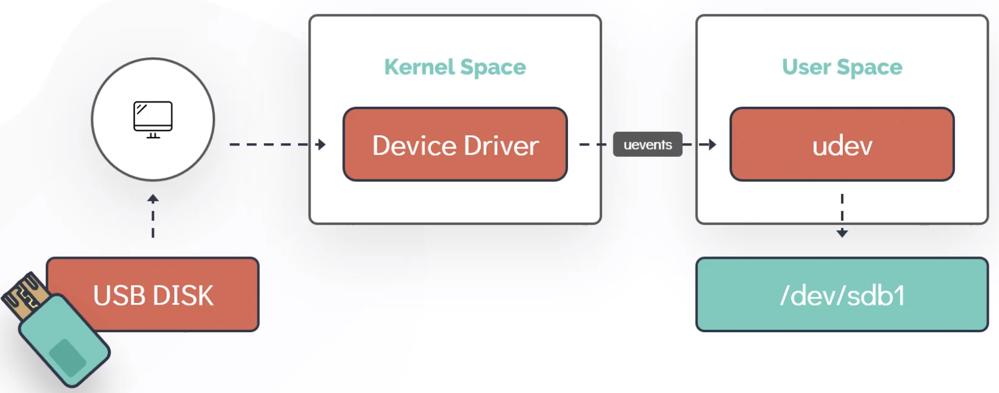

`uevents` occur when new hardware is detected, they are messages

`dmesg` is used to examine or control the kernel ring buffer.

 is used to control and query the udev database and events.

`udevadm`


`lspci` prints detailed information about all PCI buses and devices in the system.


`lsblk` prints information about block devices, partitions and filesystems.


`lscpu` prints information about the CPU.

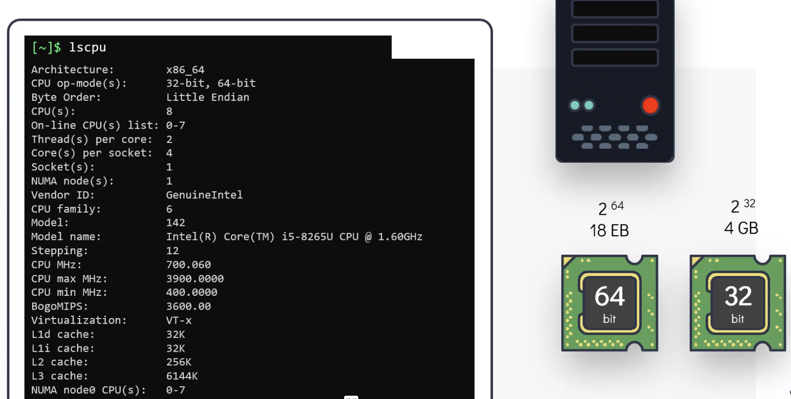

The socket is the physical slot on the motherboard.
The core is how many phyiscal CPUs.
The threads is how many logical CPUs per CPU core.
The total CPU amount is sockets x cores x threads.

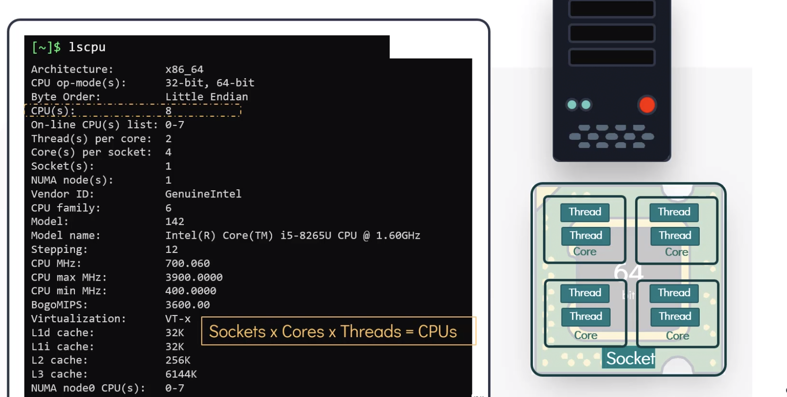

`lsmem` prints information about the RAM.

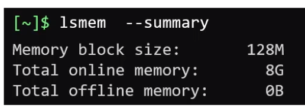

`lshw` prints detailed information about all hardware.


There are 4 high level steps to the boot process:
1. BIOS POST
   1. Basic Input/Output System - Power On Self Test. This is done by the computer's hardware.
2. Boot loader, e.g. GRUB 2.
   1. The first sector of the disk points to the boot loader which is stored in `/boot`. The boot loader is responsible for starting the kernel.
   2. The kernel is stored in a compressed state to save disk space.
3. Kernel initialisaion.
   1. The compressed kernel is loaded into memory and is decompressed. The kernel performs a series of startup steps. The final step is loading the system initialisation process.
4. System initialisation, e.g. systemd. Sys5 was replaced by systemd.
   1. This sets up the user space.


Use `ls -l /sbin/init` to see which system initialisastion proces is being used.


The 2 most common run levels are:
* 3 for the shell.
* 5 for GUI.

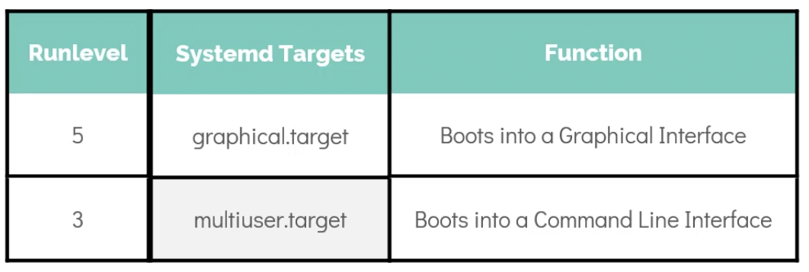

`systemctl get-default`  shows what the current run level is and `systemctl set-default $LEVEL` changes the run leve.


There are 3 types of files in Linux:
1. Regular files,
2. Directories,
3. Special files.


There are 5 special file types:
1. Character files are serial devices in `/dev` like the mouse and keyboard.
2. Block files are block storage devices in `/dev` like HDDs, SSDs, and RAM.
3. Links:
   1. Hard Links
   2. Symbolic LInks
4. Socket files enable communication between two processes. e.g. a Unix socket for `localhost` connectivity.
5. Named Pipes allow data to flow from one process to another. e.g. `$CMD1 | $CMD2`

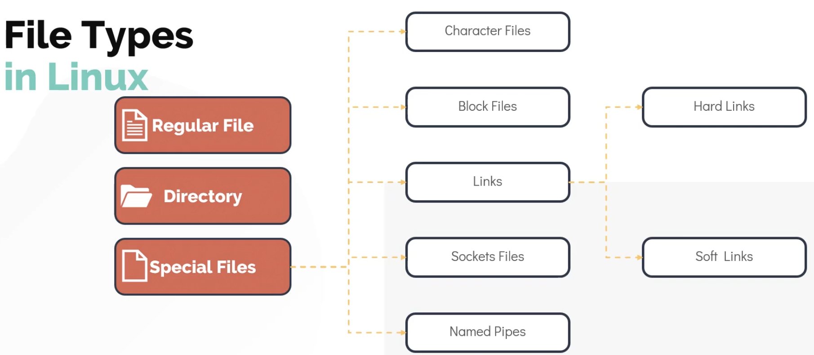

The file attributes in `ls -l` are:


A software package is a compressed archive that contains all the files required by a particular software to run.


The manifest contains the information required for that particular software to run correctly. Package managers use this file to install dependencies.

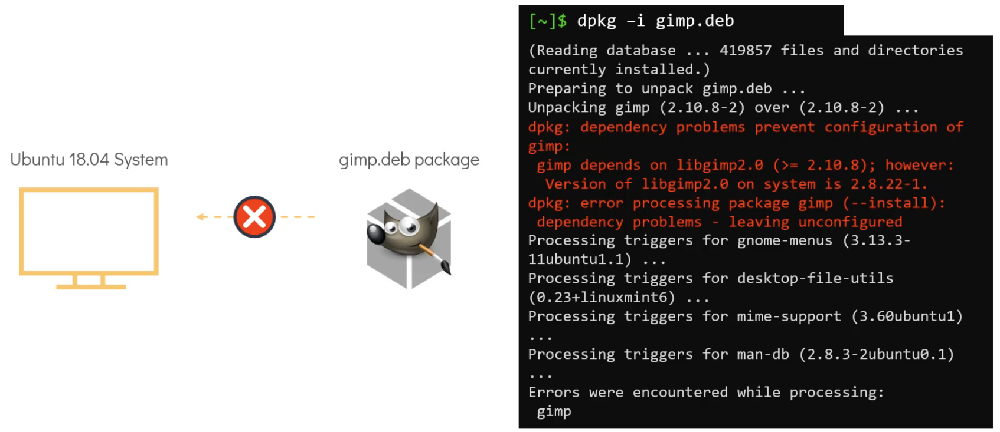


`apt` and the original `apt-get` are the frontend of the `dpkg` package manager. Similarly, `dnf` and the original `yum` are the frontend of the `rpm` package manager. These frontends provide dependency resolution and other advanced features.


The Red Hat Package manager uses `.rpm` files and has 5 main methods:
1. Installing `rpm -i $RPM_FILE`
2. Uninstalling `rpm -e $RPM_FILE`,
3. Upgrading `rpm -U $PACKAGE`,
4. Querying `rpm -q $PACKAGE` to query the `/var/lib/rpm` database,
5. Verifying `rpm -V $PACKAGE`.

`/etc/yum.repos.d/redhat.repo` points to the official Red Hat repository.


`yum repolist` shows all repositories in the system.


`yum provides $PACKAGE` shows which repo provides `$PACKAGE`.


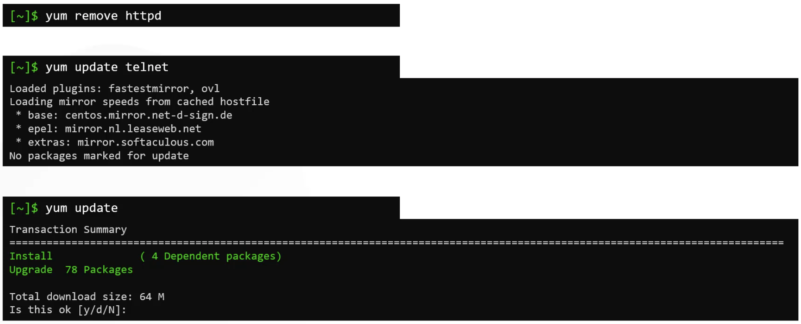

The Debian Package manager uses `.deb` files and has 5 main methods:
1. Installing `dpkg -i $DEB_FILE`
2. Uninstalling `dpkg -i $DEB_FILE`,
3. Upgrading `dpkg -l $PACKAGE`,
4. Querying `dpkg -s $PACKAGE`,
5. Verifying `dpkg -p $PACKAGE_PATH`.

`/etc/apt/sources.list` contains repositories.


`apt edit-sources` opens `/etc/apt/sources.list` in a text editor for editing.

`apt search $PACKAGE` to search for a package.

`apt list | grep $PACKAGE` to search all available packages.

Use `apt` over `apt-get`.

# Working With The Shell Part 2

Anki cards needed below this line.
---

File compression is a process of reducing the size of one or more files to make them smaller and more manageable. This is typically done to save storage space, reduce bandwidth usage when transmitting files over networks, and speed up file transfers.

There are 3 popular compression tools in Linux:
1. `bzip2` which can be uncompressed with `bunzip2`.
2. `gzip` which can be uncompressed with `gunzip`.
3. `xz` which can be uncompressed with `unxz`.

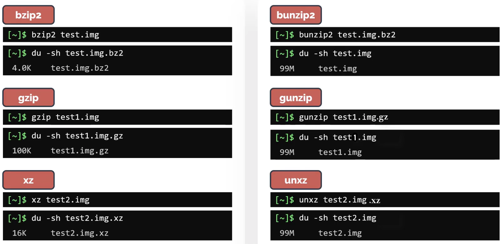

You can work with compressed files with tools like:
* `zcat`, `bzcat`, and `xzcat`.
* `zless`, `bzless`, and `xzless`.
* `zgrep`, `bzgrep`, and `xzgrep`.
* `zdiff`, `bzdiff`, and `xzdiff`.


Use `locate $FILENAME` to search for a file in a database of paths. You can update this database with `updatedb`. This requires M-locate DB to be installed.


`grep -v $STRING` can be used to match all lines that don't have `$STRING`.

`grep -w $WORD` can be used to search for words boundaries.

`update-alternatives --display editor` shows which editor is being used.

# Networking

By default the `/etc/hosts` file takes precedence over the `/etc/resolv.conf` file. This can be changed with `/etc/nsswitch.conf` and the `hosts:` section.

The DNS server can also be configured to forward unresolvable traffic elsewhere.

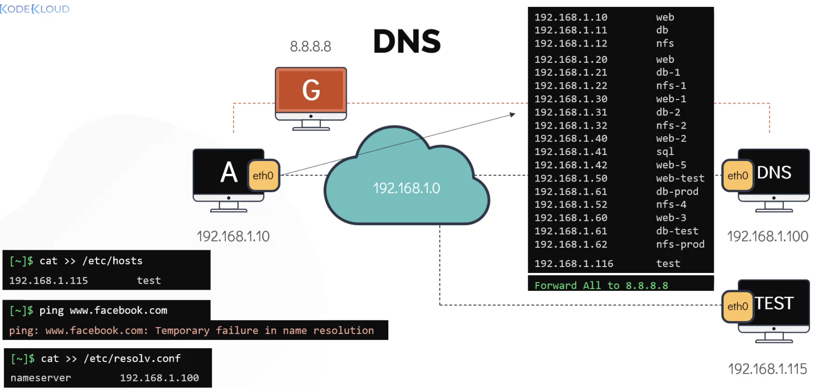

Adding `search $DOMAIN` into `/etc/resolv.conf` simplifies hostname resolution by automatically appending domain suffixes to hostnames, thereby reducing the need for fully qualified domain name entries in various network commands.


`nslookup` ignores `/etc/hosts` when doing DNS resolution. `dig` is an alternative to `nslookup`.


A switch can only deliver packets within the same network. A router is needed to forward packets between networks.


A gateway is needed to define where to send packets outside of the network, i.e. to a router.

The `route` command output can be read as follows:
* Destination: This column shows the destination network or IP address. It indicates where packets are being routed.
* Gateway: This column displays the IP address of the gateway (router) that packets should be sent to in order to reach the destination network.
  * `Gateway *` or `Gateway 0.0.0.0` in the route output indicates that the route is directly connected, and packets destined for the specified network can be sent directly through the associated network interface without involving a gateway router.
* Genmask (Netmask): This column specifies the netmask associated with the destination network. It determines the size of the network that the route applies to.
* Flags: These are flags that describe the route's properties, such as whether it's a host-specific route (U for up), a gateway route (G), or a dynamically created route (D).

```
Kernel IP routing table
Destination     Gateway         Genmask         Flags Metric Ref    Use Iface
default         192.168.1.1     0.0.0.0         UG    100    0        0 eth0
192.168.1.0     *               255.255.255.0   U     0      0        0 eth0
```

* `default`: This route directs all packets with no specific route match to 192.168.1.1, which is the default gateway.
* `192.168.1.0`: This route indicates that packets destined for the 192.168.1.0/24 network (i.e., IP addresses from 192.168.1.1 to 192.168.1.254) should be sent directly through the eth0 interface.

`ip` commands are not persistent unless they are added to the `/etc/network` file.

Use `ip link set dev $NIC up` to enable an interface.

Use `ip route add default via $IP_ADDRESS` to add a default route.

These are the basic network troubleshooting steps:
* Check your interface is up with `ip -c -h a`
* Check DNS is working with `nslookup $HOSTNAME`
* Check if you can `ping` the remote host. This may be blocked though.
* Check if there are any network problems between you and the host with `traceroute $IP` or `mtr $IP`
* Connect to the host and check if the interface is up with `ip -c -h a`
* Connect to the host and check if the service is running with `ss -lntp` or `ss -untp`.

# Security & File Permissions

There are a lot of layers to security in Linux.


Inside of `/etc/passwd`:
* The `x` in the `PASSWORD` field means the user's password is set inside of `/etc/shadow`.
* The `GECOS` field can be a CSV of anything, typically it will be things like `Name, phone, address` etc.

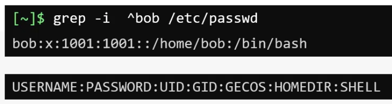

Inside of `/etc/shadow`:
* An empty `PASSWORD` field means the password was never set.
* The `LASTCHANGE` field is a Unix epoch number representing when the password was last changed.
* The `MINAGE` field defines how many days a user must wait before being able to change their password.
* The `MAXAGE` field defines how many days until a user is forced to change their password.
* The `WARN` field is how many days to print a warning before a password will expire.
* The `INACTIVE` field is how many days after a password has expired that it can be accepted before the account is disabled without a password change.
* The `EXPDATE` field is a Unix epoch number representing when the password will expire.
* If fields are empty they will not be enforced.

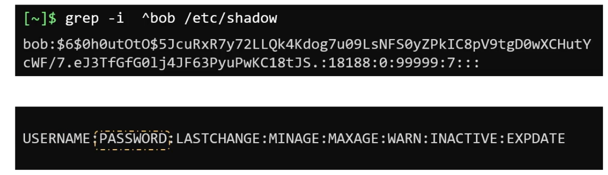

Inside of `/etc/group` the `x` in the `PASSWORD` field means the user's password is set inside of `/etc/shadow`.

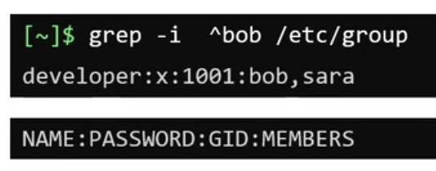

Linux permissions are checked sequentially until permission is granted or there is nothing left to check. The user is checked first, followed by the group, and followed by other.

If you add `sudo` into a cronjob it will be run under the `root` user's cron.

You can use step values in cron. e.g. `*/2` in the minute field means run the job every 2 minutes. The full list is:
* `*`	is any value.
* `,`	is a value list separator.
* `-` is a range of values.
* `/` is step values.

Use https://crontab.guru/ to make it easy.


There are 3 types of `iptables` chains:
1. `INPUT` which is incoming / ingress traffic.
2. `FORWARD` which is incoming / ingress traffic that is being forwarded.
3. `OUTPUT` which is outgoing / egress traffic.

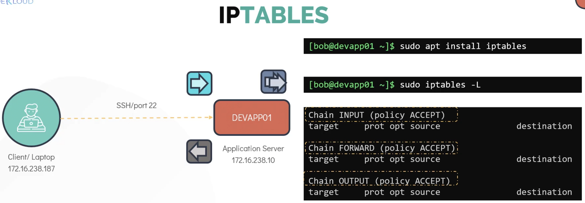

They are called chains because they can have a list of rules. Each rules in the chain's list is checked iteratively until a matching rule is found. You need to explicitly add a rule to block traffic and it typically is the last rule in the chain.


Here are some common `iptables` options:
* `-A` to add a rule to the end of the chain.
* `-I` to add a rule at the top of the chain or into the specified position.
* `-D` to delete the specified rule from the specified chain.
* `-p` to specify a protocol.
* `-s` to specify the source.
* `-d` to specify the destination.
* `-dport` to specifty the destination port.
* `-j` to specify the action to take. Which could be:
    * `ACCEPT` means to allow traffic.
    * `DROP` means to block traffic.


You do not need a specific rule for callback traffic. You only need an `OUTPUT` rule for egress traffic on the source and an `INPUT` rule for ingress traffic on the destination. The callback traffic is automatically handled via a random TCP/IP port.


There is a common ephermeral port range which is `32,768` to `60,999`


`iptables -A INPUT -j DROP` to drop all incoming traffic.

# Service Management

System D services are automatically logged to the System D Journal which is accessible via `journalctl`. The `[Unit]` section can be used to define another service that must be running before this service is started.

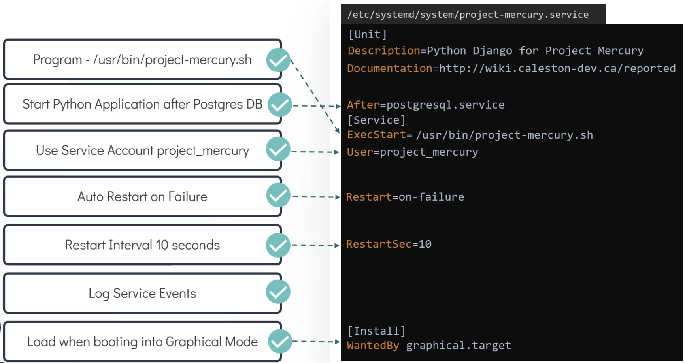

You can use `systemctl` for a variety of purposes.

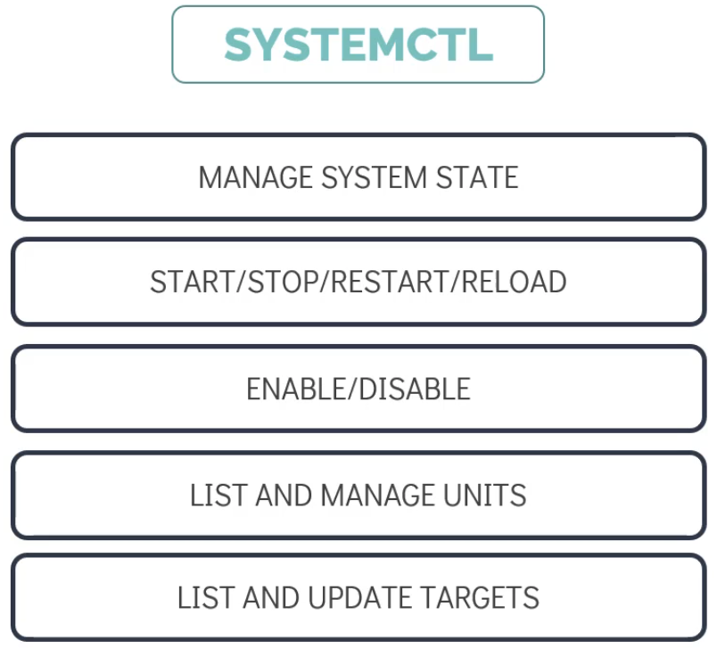

The `Activating` and `Deactivating` `systemctl status $SERVICE` states are used when a service is inbetween `Active`, `Inactive`, or `Failed`.

You can edit System D service files with `systemctl edit $SERVICE --full` and these changes are applied immediately without needing to do `systemctl daemon-reload`

`systemctl cat $SERVICE` can be used to show the service.

`systemctl list-units` shows information about active units and `systemctl list-units --all` shows information about all units.

`journalctl -b` shows all logs since the current boot (`-b`).

`journalctl -b -1` shows all logs since the current boot (`-b`) minus _n_ (`-1`).

`journalctl -b -p err` shows all error (`-p err`) logs since the current boot (`-b`).

`journalctl -xe` starts at the end of the log (`-e`) and shows additional context (`-x`).

# Storage

A block devices are a file in `/dev` for data storage hardware like HDDs, SSDs, and RAM. They are called block storage because data is written into chunks called blocks.

`ls -l /dev | grep '^b'` can show block devices and their major and minor numbers.
* The major number identifies the driver associated with the device.
* You can view major numbers in `/proc/devices`.
* `sd` is number 8 which is for SCSI disks.
* The minor number is only used by the driver.


Disk partitions are the logical sections of a physical storage device. They enable you to divide the whole storage device into sections which can be managed independently.

`fdisk -l /dev/$DEVICE` displays information about the storage device's partitions.

image-48.png)

There are 3 types of disk partitions:
1. **Primary partition**, a partition that contains one filesystem only.
   1. Traditional partitioning schemes like the Master Boot Record (MBR) only allow for 4 primary partitions per disk.
2. **Extended partition**, a partition that only contains logical filesystems.
   1. Only one extended partition is allowed. It is used to get around the 4 primary partition limit.
3. **Logical partition**, a partition that is contained inside the extended partition and it stores data on a single filesystem.
   1. There can be many logical partitions with different filesystems within the extended partition.


The maximum partition size in an MBR partition is 2 terabytes (TB).

GUID Partition Table (GPT) was created to address the limitations of the MBR partitioning scheme. The maximum partition size and the maximum amount of partitions in GPT is goverened by the O/S.

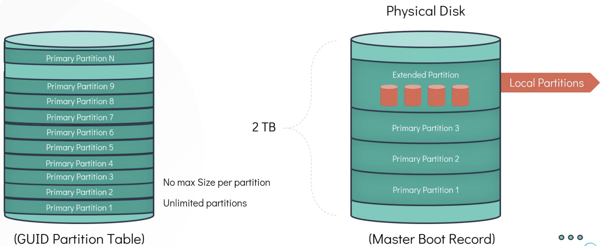

`gdisk` is an improved version of `fdisk`. Use either `fdisk /dev/$DEVICE` or `gdisk /dev/$DEVICE` to manipulate a disk's partitions.
* `?` to view the help which explains how to use it.
* `+500M` would add 500 Megabytes (MB).


There are 3 steps to using a disk.
1. Create a disk partition.
2. Create a filesystem.
   1. This defines how data is stored on the disk.
3. Mount the filesystem to a folder.


`ext2` doesn't use a journal.

An `ext4` filesystem can be mounted as an `ext3` or `ext2` filesystem. An `ext3` filesystem can be mounted as an `ext2` filesystem.


`mkfs.ext4 $DEVICE_PATH` will create an `ext4` filesystem on the specified `$DEVICE_PATH`.

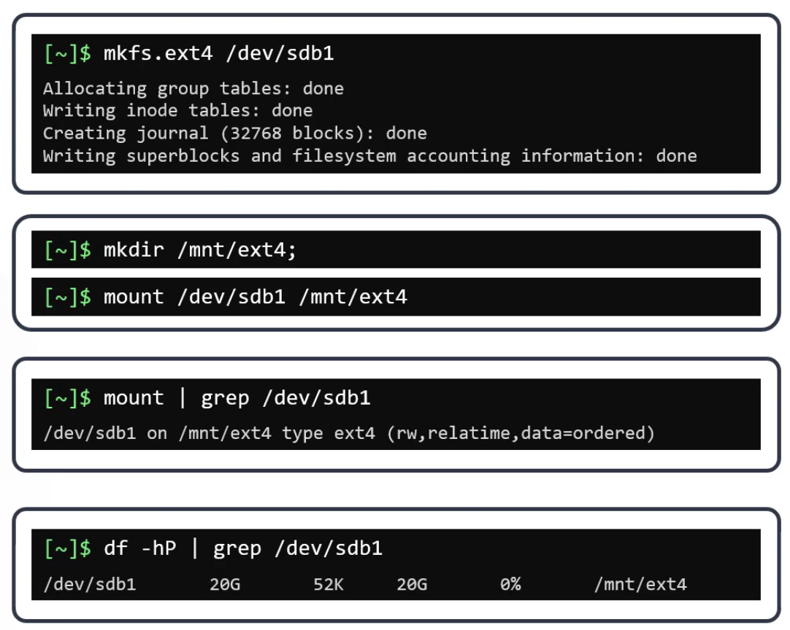

Use the `/etc/fstab` to make a partition mount automatically available after reboot.


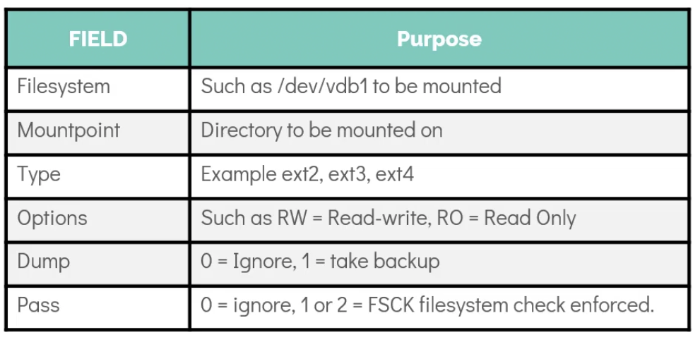

There are 3 common enterprise grade, high capacity, and external storage.
1. **Direct Attached Storage (DAS).**
2. **Network Attached Storage (NAS).**
3. **Storage Area Network (SAN).**


DAS refers to storage devices directly attached to a server or a computer, typically through a cable such as SATA, SAS, or USB. It is direct block-level access.

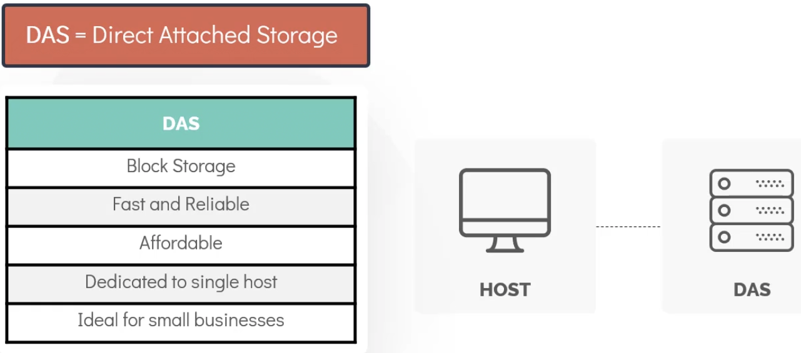

NAS is a storage device (or multiple drives) connected to a network, providing file-level data access to multiple clients simultaneously. This is typically over the **Network File System (NFS) protocol**.

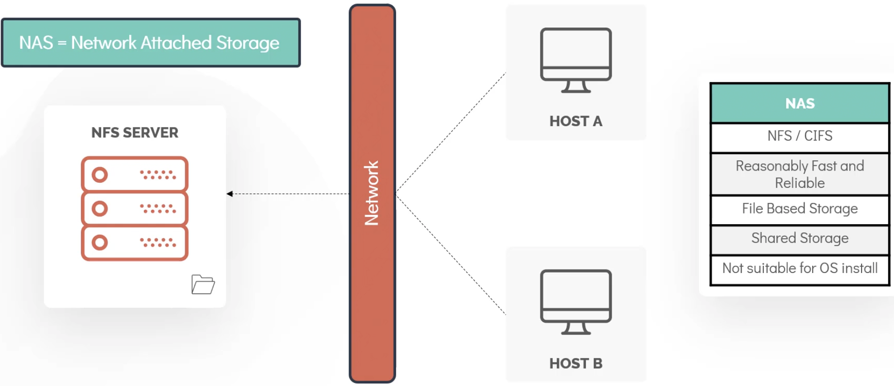

SAN is a dedicated high-speed network that connects storage devices (storage arrays) to servers, providing block-level storage access. This can be over ethernet or **Fibre Channel Protocol (FCP)**.


NFS is a distributed file system protocol that allows a client system to access files over a network as if they were stored locally. It doesn't save data in blocks, it saves it in files.

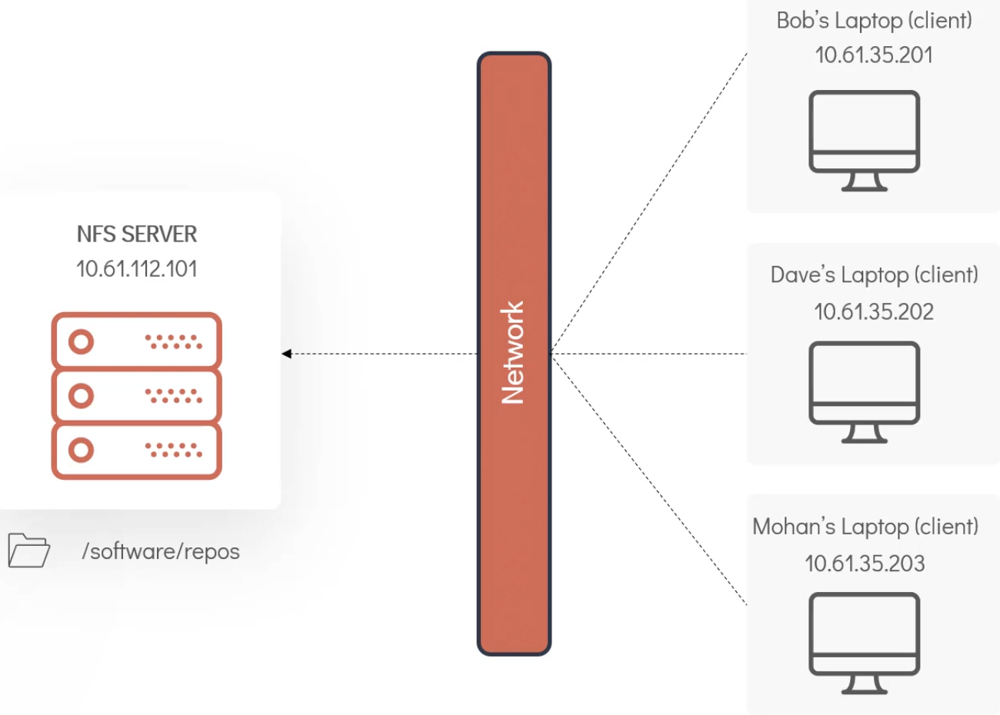

In NFS directory sharing is called exports. `/etc/exports` is an NFS server file that defines which clients can access the NFS server folders.


Running `exportfs -a` can export all NFS server shares to the defined clients. `exportfs -o $CLIENT:$NFS_PATH` can be used to export to a single client. Clients will still need to mount these folders locally.


**Logical Volume Manage (LVM)** is a software-based system used for managing storage volumes on Linux operating systems. It provides a layer of abstraction between physical disks (or disk partitions) and the file systems mounted on them. There are 4 key concepts in LVMs.
1. **Physical Volume (PV)**  are individual storage devices or partitions.
2. **Volume Groups (VG)** are created by combining one or more Physical Volumes into a single storage pool.
3. **Logical Volumes (LV)** are virtual partitions created within Volume Groups.
4. LVM maps LVs onto PVs using extent mapping. An **extent** is a fixed-size block of storage (typically 4 MB) that serves as the basic unit of allocation within LVM.


There are 5 steps to using LVMs.
1. Create a Physical Volume (PV) with `pvcreate $DEVICE_PATH`
2. Create a Volume Group (VG) with `vgcreate $VG_NAME $DEVICE_PATH`. You can use 1 or many PVs.
3. Create a linear Logical Volume (LV) with `lvcreate -L $SIZE -n $LV_NAME $VG_NAME`. There are many other types of LVs, e.g. striped, RAID 1, etc.
4. Create a filesystem on the LV with `mkfs.ext4 /dev/$VG_NAME/$LV_NAME`
5. Mount the LV into the filesystem witrh `mount -t ext4 /dev/$VG_NAME/$LV_NAME $MOUNT_PATH`

`pvs`, `vgs`, and `lvs` can be used to view basic details about PVs, VGs, and LGs respectively.

`pvdisplay`, `vgdisplay`, and `lvdisplay` can be used to view details about PVs, VGs, and LGs respectively.

There are 2 steps to resize an LV.
1. Resize the linear LV with `lvresize -L +$SIZE -n /dev/$VG_NAME/$LV_NAME`.
2. Resize the filesystem with `resize2fs /dev/$VG_NAME/$LV_NAME`.

LVs are available for access at 2 places:
1. `/dev/$VG_NAME/$LV_NAME`.
2. `/dev/mapper/$VG_NAME-$LV_NAME`.
